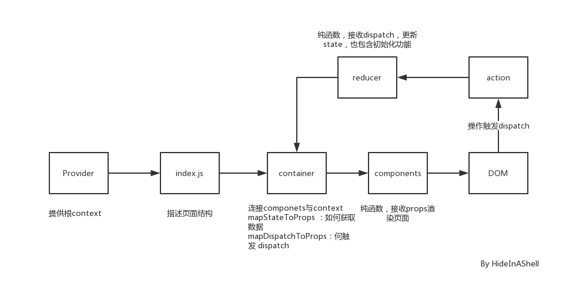

# redux

action 管理发送的数据,  可以类比为请求(url,data)
reducer 纯函数，接收dispatch，更新state，也包含初始化功能
store 创建实例，存储state，实现dispatch等功能
provider 提供根节点context，避免业务组件中出现context

所有的 Dumb 组件都放在 components/ 目录下，所有的 Smart 的组件都放在 containers/ 目录下，这是一种约定俗成的规则

个人理解的流程：

<!--  -->