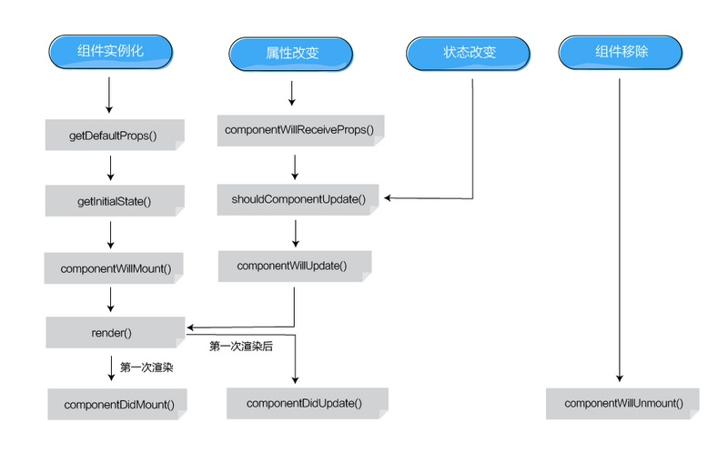

# React

react 是一个视图层框架，或者说是一个 UI 库

## 引入

在 Node.js 及 npm 情况下使用

```
npm install react babel-preset-react react-dom --save-dev
```

## 使用

```
import React from 'react';
//渲染元素,只可以存在一个顶级组件
ReactDOM.render(
  <h1>Hello, world!</h1>,
  document.getElementById('root')
);
//或 此例将'react-dom'的属性赋值给render变量
import React from 'react';
import {render} from 'react-dom';

render(
  <h1>Hello, world!</h1>,
  document.getElementById('root')
);
```

### JSX

JSX 是 javascript 的一种扩展语法，在 React 中使用。

- 可以使用类 HTML 语法
- 用花括号包裹任意的 JavaScript 表达式，可以嵌入到 JSX 中
  - 添加内联样式时，要用两个花括号包住，值是 string，要用单引号包住
- JSX 中不能使用 if 语句
- JSX 中给 div 增加类名时要使用`className`,`class`是 ES6 关键字
  - 但在 16.3.0 版本中使用`class`,有效？
  - label 的 for 属性要写成 `htmlFor`？

```
//赋属性值
const element = </img>;
const element = <div tabIndex="0"></div>;

//使用单独的JSX文件
ReactDOM.render(
  <h1>Hello, world!</h1>,
  document.getElementById('example')
);
//引入
<script type="text/babel" src="helloworld_react.js"></script>
```

### 组件(Components) 、 属性(Props) 和 状态(state)

示例：welcome 组件接受 props 作为参数

```
function Welcome(props) {
  return <h1>Hello, {props.name}</h1>;
}
//等同于
class Welcome extends React.Component {
  render() {
    return <h1>Hello, {this.props.name}</h1>;
  }
}
```

所有 React 组件都必须是纯函数（输出结果只依赖于参数，并且没有副作用），并禁止修改其自身 props，为了实现实时更新,就需要使用到 state 属性。
`this.state`在构造函数里初始化,修改值则通过`this.setState()`方法，以下是封装路径导航组件时的一段代码：

```
class NetDisk extends React.Component {
    constructor(props){
        super(props);
        this.state = {
            AddressDataSource : [{
                name : '我的网盘'
            }],
            address : '/'
        };
    }
}
setAddressDataSource(dataSource){
       this.setState({
           AddressDataSource : dataSource,
           address:dataSource.map((p)=>{
               return p.name;
           }).join("/").substring(4)
       });
   }
```

所有嵌套在组件中的 JSX 结构都可以在组件内部通过 props.children 获取到;
这里需要注意，this.props.children 的值有三种可能：如果当前组件没有子节点，它就是 undefined;如果有一个子节点，数据类型是 Object;如果有多个子节点，数据类型就是 array。所以，处理 this.props.children 的时候要小心。
React 提供一个工具方法 React.Children 来处理 this.props.children。我们可以用 React.Children.map 来遍历子节点，而不用担心 this.props.children 的数据类型是 undefined 还是 object。

```
class Layout extends Component {
  render () {
    return (
      <div className='two-cols-layout'>
        <div className='sidebar'>
          {this.props.children[0]}
        </div>
        <div className='main'>
          {this.props.children[1]}
        </div>
      </div>
    )
  }
}
```
### 常用的组件设计模式
组件可以说是react中的基本单元，常用的组件类别有：
有状态组件（容器组件、聪明组件）、无状态组件（傻瓜组件、展示组件），高阶组件，Render Props等
有状态组件与容器组件这样的几种组件定义不完全相同。实际使用中互相交叉，但基本可以理解为同一种组件模式，即分离数据与操作。
#### 有状态组件
包含state且随着事件或者外部的消息而发生改变，通常会使用生命周期，在写业务逻辑时经常使用。
#### 无状态组件
不包含state，所以就是纯静态的展示作用，基本结构就是props加上render，复用性很强。
```
const PureComponent = (props) => (
    <div>
        //use props
    </div>
)
```
#### 高阶组件(HOC)
“高阶组件”名为“组件”，其实并不是一个组件，而是一个函数，它接受至少一个 React 组件为参数，并且能够返回一个全新的 React 组件作为结果。
高阶组件可以对原组件进行功能增强，添加新的行为，一般来说是提取公共逻辑，例如在不同页面都要判定是否登陆时，登陆验证就可以写成一个高阶组件。
```
const withLoginAndLogout = (ComponentForLogin, ComponentForLogout) => {
  const NewComponent = (props) => {
    if (getUserId()) {
      return <ComponentForLogin {...props} />;
    } else {
      return <ComponentForLogout{...props} />;
    }
  }
  return NewComponent;
};
```
在使用高阶组件时，需要处理dispalyName，这是为了方便debug，模式十分固定，但确实麻烦。
```
const withExample = (Component) => {
  const NewComponent = (props) => {
    return <Component {...props} />;
  }
  NewComponent.displayName = `withExample(${Component.displayName || Component.name || 'Component'})`;
  return NewCompoennt;
};

```

使用时也要避免重复产生react组件。
```
<!-- 每次都会生成一个新的 EnhancedFoo-->
const Example = () => {
  const EnhancedFoo = withExample(Foo);
  return <EnhancedFoo />
}

<!-- 只会生成一个 EnhancedFoo -->
const EnhancedFoo = withExample(Foo);
const Example = () => {
  return <EnhancedFoo />
}
```

#### Render Props
render props即渲染属性，用于使用一个值为函数的 prop 在 React 组件之间的代码共享。
撰写复用组件时，可以先考虑render props，再考虑高阶组件。
```
const Bar = ({ title }) => (<p>{title}</p>);

class Foo extends React.Component {
    constructor(props) {
        super(props);
        this.state = { title: '我是一个state的属性' };
    }
    render() {
        const { render,children } = this.props;
        const { title } = this.state;

        return (
            <div>
                {render(title)}
                {children? children():''}
            </div>
        )
    }
}

class App extends React.Component {
    renderFoo(title) {
        return <Bar title={title} />;
    }
    render() {
        return (
            <div>
                <h2>这是一个示例组件</h2>
                <!-- 使用render传递，但这种写法每次都会重新渲染一个bar组件，影响性能，要避免-->
                <Foo render={(title) => <Bar title={title} />} >
                <!-- 使用children传递 -->
                    {() => (
                        <h1>hello world</h1>
                    )}
                </Foo>
                <!-- 这种写法不会影响性能 -->
                <Foo   render={this.renderFoo}></Foo>

            </div>
        );
    }
}

```


### 生命周期

React Components 生命周期分为三个大阶段

- Mounted (组件实例化)
  - 组件被 render 解析生成对应的 DOM 结构并插入浏览器的过程
- Update (组件更新)
  - 已经 Mounted 的组件被重新 render 的过程(`setState()` or`setProps()`)
- Unmonted （销毁组件)
  - 已经 Mounted 的组件对应的 DOM 节点被从 DOM 结构中移除的过程

每个不同阶段都有对应的 hock（钩子）函数


### 处理事件 与 获取 DOM 元素

- React 事件使用驼峰命名，而不是全部小写
- 通过 JSX , 你传递一个函数作为事件处理程序，而不是一个字符串
- 在 React 中不能通过返回 false 来阻止默认行为。必须明确调用 preventDefault
- 事件最好在构造函数中先行绑定 this，避免调用事件时 this 指向 undifined

```
function ActionLink() {
  function handleClick(e) {
    //阻止默认行为
    e.preventDefault();
    console.log('The link was clicked.');
  }

  return (
    <a href="#" onClick={handleClick}>
      Click me
    </a>
  );
}
//事件传参的两种写法
<button onClick={(e) => this.deleteRow(id, e)}>Delete Row</button>
<button onClick={this.deleteRow.bind(this, id)}>Delete Row</button>
```

React.js 当中提供了 ref 属性来帮助我们获取已经挂载的元素的 DOM 节点，你可以给某个 JSX 元素加上 ref 属性;之后在 componentDidMount 中使用这个 dom 元素。

### 条件渲染

要复合使用各个单独组件，并根据情况判断使用与否或传参（条件渲染），需要构建一个复合组件，通过该复合组件调用各个单独组件，此时，应用复合组件的`this.State`来传值、修改，而不能使用单独组件的`this.state`。

### 遍历

React 中遍历数组等和 javascript 类似，可以使用 map 等方法遍历，不过不太一样的是，必须要给遍历的数组元素加上`key`属性。

- 该属性在页面上不显示，是 react 内部使用
- 列表项可能被重新排序时，不建议使用索引作为 keys，因为这导致一定的性能问题
- key 在同辈元素中必须是唯一的

```
function NumberList(props) {
  const numbers = props.numbers;
  const listItems = numbers.map((number,index) =>
    <ListItem value={number} key={index}/>
  );
  return (
    <ul>
      {listItems}
    </ul>
  );
}
```


### context
**以下内容尚未实践并验证**
子组件可通过 `context` 获取到父组件的参数，而不必通过 props 的方式层层传递，但是这种方法比较危险
父组件需要

```
  static childContextTypes = {
    dataToChild: PropTypes.string
  }
  getChildContext () {
    return { dataToChild: this.state.dataToChild }
  }
```

子组件需要

```
  static contextTypes = {
    dataToChild: PropTypes.string
  }

  <!-- 获取dataToChild  -->
  <!-- this.context.dataToChild -->

```

### [Virtual DOM 算法](https://github.com/livoras/blog/issues/13)
根本： DOM结构可以用javascript描述
顺序：
- JS模拟DOM树，并插入到页面，实现真正的DOM结构
- 实现比较新旧的虚拟DOM树
- 将不同的部分更新到真正的DOM树中
